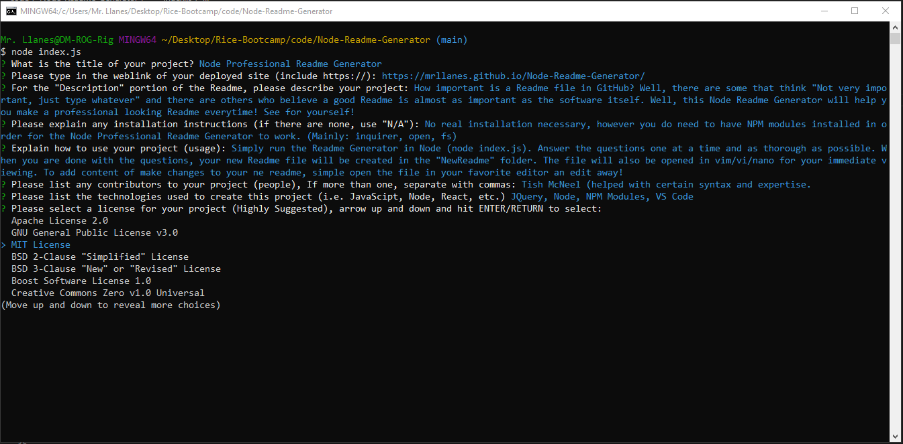
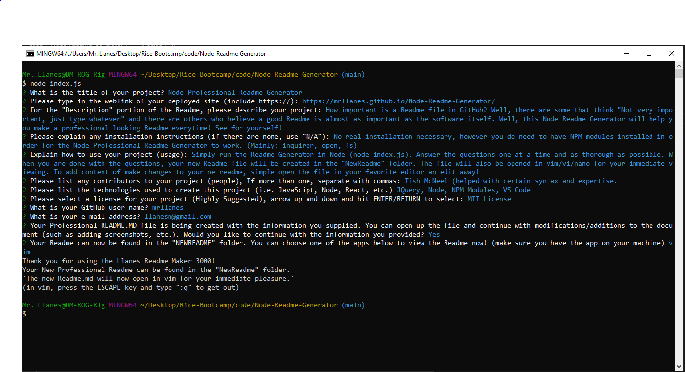
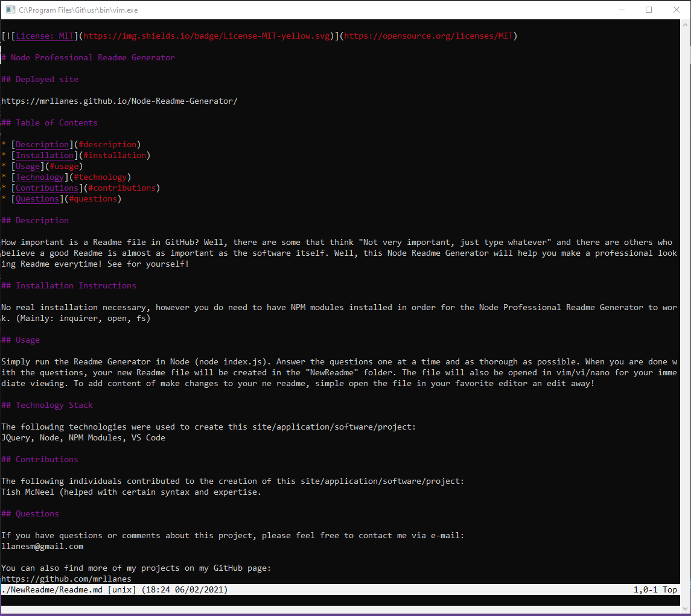

# Node Professional Readme Generator

## Deployed site

https://mrllanes.github.io/Node-Readme-Generator/

https://youtu.be/nXEyaUropb8
(Video showing usage)

## Table of Contents

- [Description](#description)
- [Installation](#installation)
- [Usage](#usage)
- [Technology](#technology)
- [Contributions](#contributions)
- [Questions](#questions)

## Description

How important is a Readme file in GitHub? Well, there are some that think "Not very important, just type whatever" and there are others who believe a good Readme is almost as important as the software itself. Well, this Node Readme Generator will help you make a professional looking Readme everytime! See for yourself!

## Installation Instructions

No real installation necessary, however you do need to have NPM modules installed in order for the Node Professional Readme Generator to work. (Mainly: inquirer, open, fs)

## Usage

- Simply run the Readme Generator in Node (node index.js).
- Answer the questions one at a time and as thorough as possible.
- When you are done with the questions, your new Readme file will be created in the "NewReadme" folder.
- The file will also be opened in vim/vi/nano for your immediate viewing.
- To add content or make changes to your new readme, simply open the file in your favorite editor an edit away!

## Technology Stack

The following technologies were used to create this site/application/software/project:

- JQuery, Node, NPM Modules, VS Code

## Contributions

The following individuals contributed to the creation of this site/application/software/project:
Tish McNeel (helped with certain syntax and expertise)

## Questions

If you have questions or comments about this project, please feel free to contact me via e-mail:
llanesm@gmail.com

You can also find more of my projects on my GitHub page:
https://github.com/mrllanes

## Screenshots

Please see the images below to see how the Node Professional Readme Generator looks!
(Yes, this readme was created using the Node Professional Readme Generator. I only went in and corrected spelling errors, formatted the "Usage" section with bullet points and added the Screenshots!)

